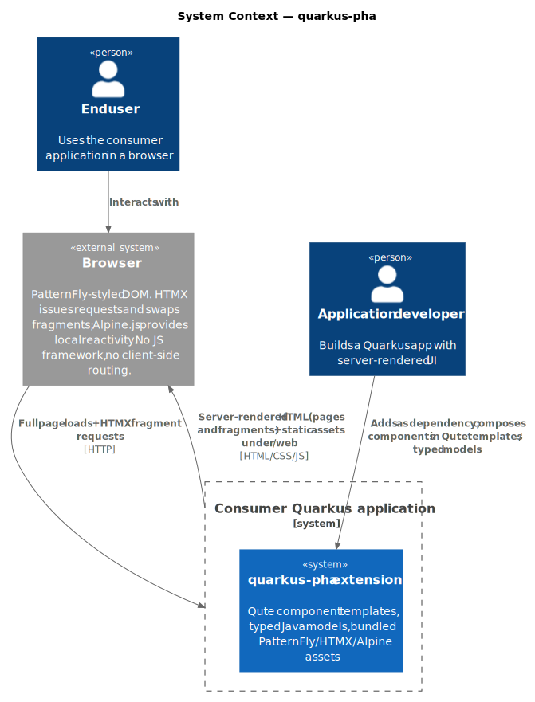
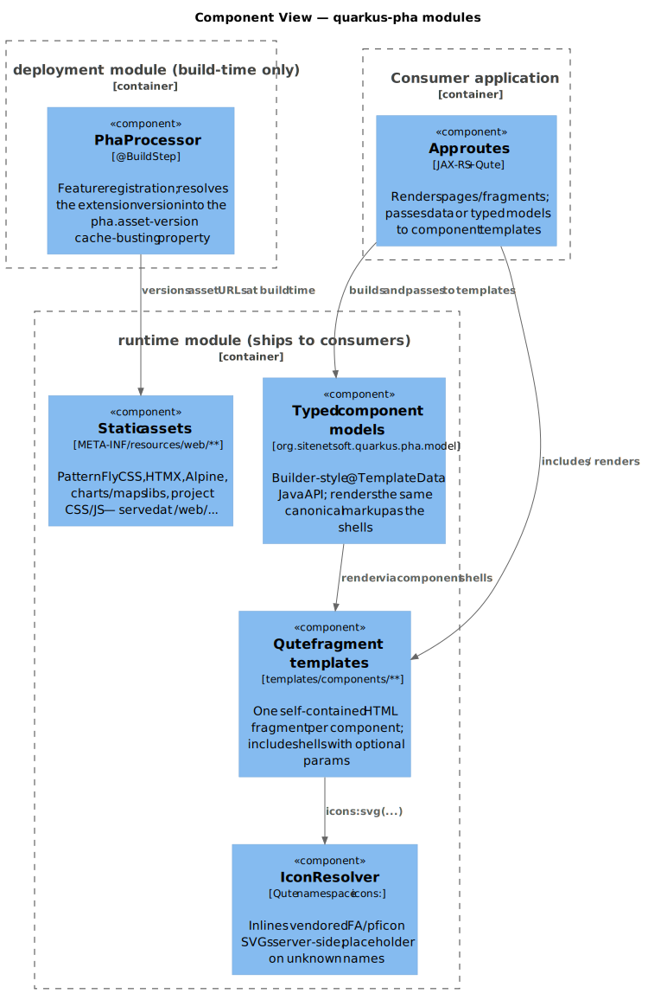
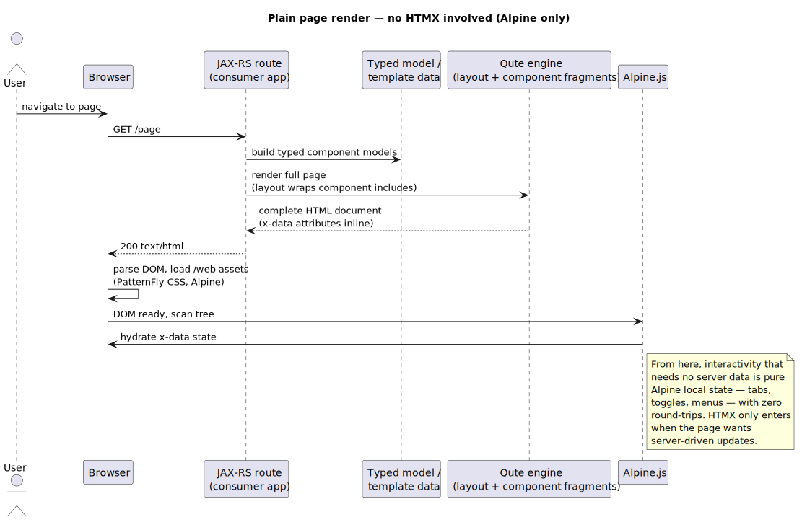
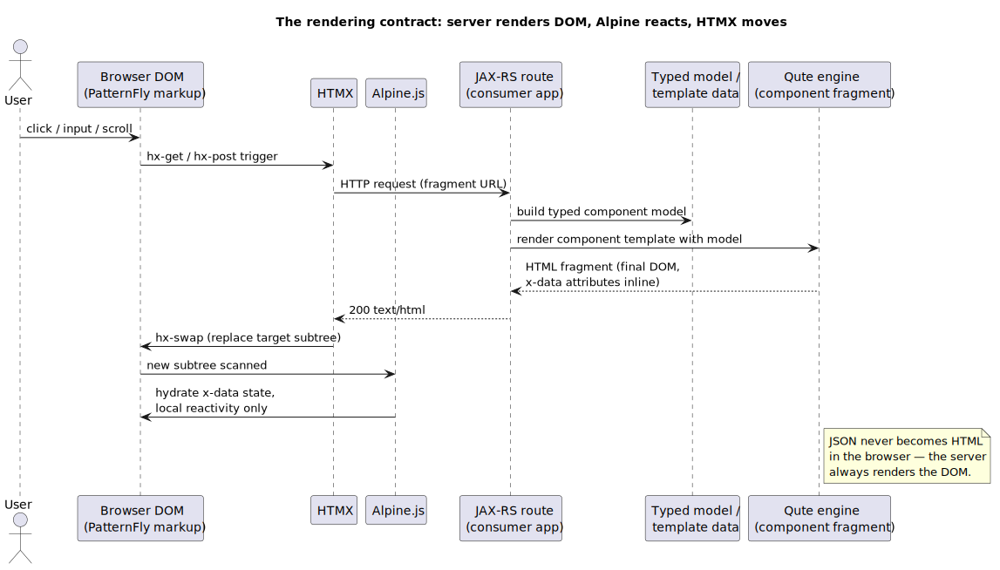

# Quarkus pha
> pha = [PatternFly](https://www.patternfly.org/) [HTMX](https://htmx.org/) [Alpine.js](https://alpinejs.dev/)
> Live component docs & demos: <https://sitenetsoft.org/quarkus-pha> (static build — for the fully interactive version, run the showcase locally)

<p align="center">
  <picture>
    <source media="(prefers-color-scheme: dark)" srcset="./assets/quarkus-pha-logo-dark.svg">
    
  </picture>
</p>

A Quarkus extension that delivers a framework-free frontend component library —
PatternFly v6 components rendered server-side as Qute templates, made interactive
with Alpine.js, and driven by the server through HTMX. No React, no virtual DOM,
no build step for consumers.

**The contract:** the server renders the DOM, Alpine reacts, HTMX moves. JSON
never reaches the browser to be templated there — Quarkus is the backend-for-frontend
and every UI transition is a server-rendered fragment swap.

| Layer | Technology |
|---|---|
| Design system | PatternFly v6 (CSS + tokens only) |
| Interactivity | Alpine.js |
| Server-driven UI | HTMX |
| Data viz / maps | Apache ECharts, D3.js, MapLibre |
| Templates | Qute (Quarkus-native) |

## Why HTMX + Alpine.js instead of React or Angular

Not because SPAs are bad — because for server-rendered business UIs, the SPA
architecture solves problems this stack doesn't have, and charges for them anyway.

**1. One state, not two.** A SPA framework keeps a client-side copy of server
state — fetched as JSON, cached in stores, invalidated, and re-synchronized on
every mutation. The developer manages two state machines and the drift between
them. Here there is nothing to synchronize: the DOM the server rendered *is*
the application state ([HATEOAS](https://htmx.org/essays/hateoas/) — hypermedia
as the engine of application state). When state changes, the server renders the
new fragment and HTMX swaps it in. Alpine holds only throwaway view state —
"is this menu open" — that no one needs to reconcile with the backend.

**2. Business logic lives once, on the server.** Because React and Angular own
a frontend state, the rules that govern that state — validation, permissions,
what's visible when — end up implemented twice: once in Java, once in the
framework. Two implementations drift, and the JSON API between them becomes a
second public interface to secure and version. In this stack the server is the
only place business logic exists; the browser receives its conclusions as HTML.

**3. Lighter, faster, easier to learn.** htmx is ~16 kB gzipped and
dependency-free; Alpine's entire API is [15 attributes, 6 properties and 2
methods](https://alpinejs.dev/) — both libraries together ship ~32 kB gzipped,
before React itself (let alone an app bundle) has loaded. The learning curve is
"attributes in your HTML", not a framework's component lifecycle, hooks rules,
and toolchain. And the end-user's machine does less: no bundle parse, no
hydration, no client-side render — first paint is the page the server sent.
The best public data point is [Contexte's production port from React to
htmx](https://htmx.org/essays/a-real-world-react-to-htmx-port/): 67 % less
code, 96 % fewer JS dependencies, 50–60 % faster time-to-interactive, 46 %
lower browser memory use, with no loss in user experience.

Two more that follow from the architecture:

- **No frontend build step.** Consumers add a Gradle dependency and write Qute.
  No Node toolchain, no bundler, no npm tree to audit.
- **Immune to framework churn.** Tiny, stable APIs mean no framework-major
  migration every couple of years — and PatternFly is consumed as CSS + tokens
  only, so its React layer's churn never reaches this stack.

The honest trade-off: highly offline, optimistic-UI, or editor-like apps
(think Figma, not dashboards) genuinely benefit from a client-side framework.
This stack targets the other 90% of business UIs — data-driven pages, forms,
tables, dashboards — where the server is already the source of truth.

## Architecture

Four views, biggest picture first. Regenerate with `bash scripts/diagrams.sh`
(sources in `docs/diagrams/`).

### System context

quarkus-pha is a Quarkus extension a consumer application depends on. The browser
receives server-rendered PatternFly DOM; HTMX moves fragments, Alpine.js reacts
locally. There is no JS framework and no client-side routing.

<picture>
  <source media="(prefers-color-scheme: dark)" srcset="docs/diagrams/c4-context-dark.svg">
  
</picture>

### Inside the extension

The runtime module ships Qute fragment templates, the typed Java component models,
the `icons:` resolver, and all static assets served under `/web`. The deployment
module runs at build time only.

<picture>
  <source media="(prefers-color-scheme: dark)" srcset="docs/diagrams/c4-components-dark.svg">
  
</picture>

### A plain page render — no HTMX

HTMX is optional. Components render identically in an ordinary full-page Qute
response, and interactivity that needs no server data afterwards — tabs,
toggles, menus — is pure Alpine local state with zero round-trips.

<picture>
  <source media="(prefers-color-scheme: dark)" srcset="docs/diagrams/sequence-page-render-dark.svg">
  
</picture>

### One HTMX interaction, end to end

The core contract: the server always renders the DOM. JSON never becomes HTML in
the browser.

<picture>
  <source media="(prefers-color-scheme: dark)" srcset="docs/diagrams/sequence-htmx-render-dark.svg">
  
</picture>

## Using components

Components are Qute includes. Simple ones take parameters:

```html
{#include components/feedback/alert variant="success" titleText="Saved" /}
```

Composite components (card, drawer, modal, data-list) are **template families** —
a thin root plus per-section sub-templates composed in the root include's main
block, mirroring how PatternFly's own React subcomponents compose:

```html
{#include components/data-display/card id="my-card" compact=true}
{#include components/data-display/card-title}Project Apollo{/include}
{#include components/data-display/card-body}Ship the dashboard by Q3.{/include}
{#include components/data-display/card-footer}Updated 2 hours ago{/include}
{/include}
```

Family conventions:

- **Content is each include's main block** — not a named slot — so titles, bodies,
  and footers can hold any markup, and nothing can collide with slot names in
  the templates that wrap yours.
- Multi-region templates (e.g. `card-header`) use **component-prefixed slots**
  (`cardActions`, `cardSelectableActions`) behind `has*` guard params.
- Roots own the standard Alpine contracts — `expandable=true` wires expand state,
  `selectedExpr="..."` binds selection — and accept an `attrs` raw passthrough
  for custom Alpine directives.
- Includes shadow inherited `id`/`attrs` so they never leak into nested includes.

### Typed component models

Every component can also be built from a typed Java model instead of template
parameters. The `org.sitenetsoft.quarkus.pha.model` package ships ~90
immutable builder classes (`Alert`, `Card`, `Table`, `Wizard`, `Toolbar`, …)
that a backend constructs and hands to the same include via a single
model parameter:

```java
Alert alert = Alert.of("Deployment complete").variant("success")
    .description("Your application is live.")
    .actionLink("View deployment", "#").actionLink("Roll back", "#")
    .build();
```

```html
{#include components/feedback/alert alert=alert /}
```

The model branch of each template renders the full PatternFly anatomy —
including the Alpine.js wiring for expandable, selectable, and editable
states — so consumers describe components as data and never touch the
markup. Both modes stay supported: template parameters for quick one-offs,
models for anything data-driven. Composite families (card, page, wizard,
toolbar) take nested records (`Card.Header`, `Wizard.Step`,
`Toolbar.Group`, …) in place of slot composition, and models compose
across components (a `Toolbar.Item` can hold a `Button` or `MenuToggle`).

Every example on the demo pages has a **Java tab** showing the exact
builder code that produced it; the props table on each page names the
model parameter for that component.

Every component has a demo page with examples matching the patternfly.org docs,
a Qute-source viewer, and a props table: run the showcase (below) and browse
`http://localhost:9090/`.

## Testing

The project ships a multi-layer test pipeline (lint, HTML/CSS/JS validation,
type-check, server-side smoke + contract, Playwright E2E with console-error
capture, axe a11y, HTMX target/header contracts, keyboard-nav, reference
checks). Run everything with:

```shell script
bash scripts/e2e.sh
```

Reports land under `.reports/` (gitignored). See [TESTING.md](TESTING.md) for
the full breakdown of what each layer catches, how to run each one
standalone, and how to add a new test layer.

## Running the showcase in dev mode

The component showcase lives in the `integration-tests` module and runs on port 9090.
Gradle needs **Java 25** — the snippets below use the Debian/Ubuntu OpenJDK path;
adjust `JAVA_HOME` to your install (or omit it if your default `java` is already 25):

```shell script
JAVA_HOME=/usr/lib/jvm/java-25-openjdk-amd64 \
  ./gradlew :quarkus-pha-integration-tests:quarkusDev
```

Then browse <http://localhost:9090/> for the component index.

## Packaging the showcase

The showcase app (the `integration-tests` module) packages like any Quarkus app:

```shell script
JAVA_HOME=/usr/lib/jvm/java-25-openjdk-amd64 \
  ./gradlew :quarkus-pha-integration-tests:quarkusBuild
```

It produces `integration-tests/build/quarkus-app/quarkus-run.jar`, runnable with
`java -jar integration-tests/build/quarkus-app/quarkus-run.jar`.

## Creating a native executable

The extension is native-image compatible — the full Playwright suite passes
against the native binary. Build it (in a container, no local GraalVM needed):

```shell script
JAVA_HOME=/usr/lib/jvm/java-25-openjdk-amd64 \
  ./gradlew :quarkus-pha-integration-tests:quarkusBuild \
  -Dquarkus.native.enabled=true \
  -Dquarkus.package.jar.enabled=false \
  -Dquarkus.native.container-build=true
```

(`-Dquarkus.package.jar.enabled=false` is required — Quarkus refuses to emit
both JAR and native outputs in one build.) The result is
`integration-tests/build/quarkus-pha-integration-tests-1.0.0-SNAPSHOT-runner`.
See <https://quarkus.io/guides/gradle-tooling> for more on native builds.

## Units
- [components](runtime/src/main/resources/templates/components)
- [layouts](runtime/src/main/resources/templates/layouts)
- [partials](runtime/src/main/resources/templates/partials)
- [structure](runtime/src/main/resources/templates/structure)

## E2E Integration Tests
- [components](integration-tests/src/main/resources/templates/components)

### `ws-preview-html` marker class

Every example fragment under `integration-tests/.../templates/components/*/` is
wrapped in `<div class="ws-preview-html">…</div>`. The `ws-` prefix stands for
**workspace** — PatternFly's name for the docs-site preview area (see
[patternfly/patternfly#887](https://github.com/patternfly/patternfly/issues/887),
which references the original `workspace.scss`). It carries **no CSS rule in
this repo** — and none upstream either.

Why we keep it anyway: it's the same marker the official patternfly.org docs
site puts on its rendered HTML previews (see
[`example.js`](https://github.com/patternfly/patternfly-org/blob/main/packages/documentation-framework/components/example/example.js)
— `<div className={css('ws-preview-html', ...)} dangerouslySetInnerHTML={...} />`).
PatternFly's docs framework leaves it unstyled on purpose so consumers have a
stable hook to target the preview area. Keeping the class means our example
markup is copy-paste compatible with PF's own examples, and we get the same
hook if we ever want to add preview-only styling.

If you ever need to add demo-only styling (e.g. consistent padding around the
example body), define `.ws-preview-html { … }` in `pha.css` rather than
inlining `style="…"` on each fragment.

## License

Apache License 2.0 — see [LICENSE](LICENSE).
Contributions welcome: see [CONTRIBUTING.md](CONTRIBUTING.md); security reports: see [SECURITY.md](SECURITY.md).
